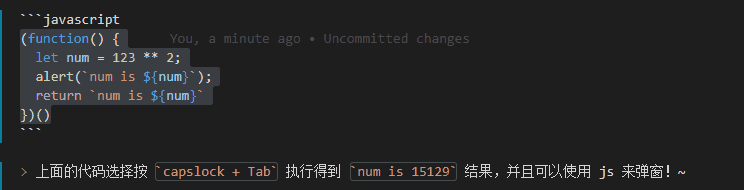
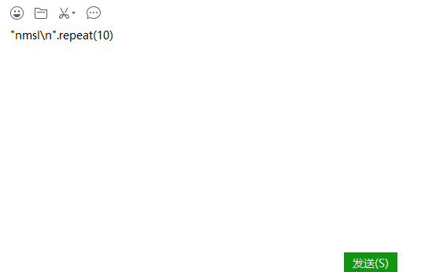
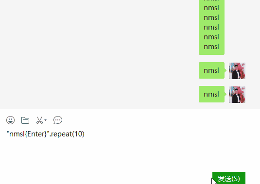

[功能说明文档](http://cjkis.me/capslock+/)    
    
---    
    
## capslock+     
    
> &emsp;&emsp;CapsLockPlus 是根据CapsLock+（[原作者版本](https://github.com/wo52616111/capslock-plus)）修改的，因为原版本不再更新了，并且功能不能满足本人的需求，所以对其进行改动。    
> &emsp;&emsp;github上也有其他人的修改版本供搭建参考。    
> &emsp;&emsp;赶鸭子上架学习 AHK 脚本。    
> &emsp;&emsp;不过这个脚本的确不太难，很多方法看文档就可以解决，而且调用起来很方便。    
    
## 改动的地方    
    
### 修复原版 Bug    
    
> &emsp;&emsp;作者的最新发行版本是有 BUG 的。    
> &emsp;&emsp;说明文档里面如下一句话    
    
    >> 输入`var i=0,j=101;while(j--)i+=j;，然后Capslock+Tab来求1~100的和。    
    
> &emsp;&emsp;但是用最新的版本运行，得不到求和反而是 ?    
    
---    
    
> &emsp;&emsp;作者为了修复 js 浮点数计算有误差的问题    
> &emsp;&emsp;代码 调用js的eval 函数进行 JavaScript 计算的时候，会在 eval 之前进行了误差修复函数的运行。    
> &emsp;&emsp;但是传入进行 eval 的未必是数字，也可能是字符串代码，这就导致上面的叠加出错。    
> &emsp;&emsp;后来我将修正函数放到 eval 外面就修复了这个问题。    
    
### babel 兼容 es6 语法     
    
> &emsp;&emsp;作者实在是太有才了，居然想到利用 AHK 调用 IE 引擎来实现 js 运行。    
> &emsp;&emsp;只可惜IE的版本实在是太久了，js的很多新语法都不支持。    
    
> &emsp;&emsp;于是我借助 babel.js 的 standalone 版本来实现浏览器内部调用 babel [旧版github仓库](https://github.com/babel/babel-standalone) [新版github仓库](https://github.com/babel/babel/tree/master/packages/babel-standalone)    
> &emsp;&emsp;大部分通过 npm 调用的 babel 都是利用 node.js precompile 代码的方案。    
> &emsp;&emsp;这个方案无法满足动态运行代码的需要，因此 standalone 版本就可以用在浏览器运行时。    
    
> &emsp;&emsp;我发现最新版本 7.0 以上的代码引入了 Symbol ，在 IE11 运行报错了。    
> &emsp;&emsp;于是我回退到了 6 上的最高版本， [bootcdn](https://www.bootcdn.cn/babel-standalone/)    
    
> &emsp;&emsp;最后，运算符，我非常喜欢 Python 的双乘号算幂方案，目前主流的浏览器都支持了。    
> &emsp;&emsp;但是 babel 不提供运算符的支持， Stack Overflow 的解决方案是通过正则表达式将代码替换为 Math.Pow    
    
```javascript    
(function() {    
  let num = 123 ** 2;    
  alert(`num is ${num}`);    
  return `num is ${num}`    
})()
```    
    
    
    
> 上面的代码选择按 `capslock + Tab` 执行得到 `num is 15129` 结果，并且可以使用 js 来弹窗！~    
    
### { } 标记直接执行 AHK 输入    
    
> &emsp;&emsp;这个是我用 capslock+ 一直就想加上去的功能。    
> &emsp;&emsp;最后还是通过自己动手实现。    
    
> &emsp;&emsp;最初有这个想法实在 repeat 函数的执行上。    
> &emsp;&emsp;通过这个js函数可以快速实现废话重复效果。    
    
```js    
"nmsl\n".repeat(10)    
```    
    
    
    
> &emsp;&emsp;但是上面这个方案只是重复字符串，没有办法触发发送按钮将废话发送出去    
    
> &emsp;&emsp;最初我是想通过 IE 来实现，毕竟 repeat 都是基于 js 实现的，而且 IE 有臭名昭著的 ActiveX 对象，或许可以操作到 windows 。    
> &emsp;&emsp;网上查了一大通，貌似 ActiveX 可以实现案件触发的功能，但是我在 IE11 测试不成功，很可能需要降版本才可以_(:з」∠)_    
    
---    
    
> &emsp;&emsp;后来搞了一轮之后，居然在网上找到了 AHK 的方案，我裂开了。    
> &emsp;&emsp;确实 AHK 就是最佳的输入处理工具呀！~    
> &emsp;&emsp;于是我的新想法就是输入 {enter} 这种类型的 AHK 代码可以自动转换为输入。    
    
---    
    
> &emsp;&emsp;经过我的努力，我成功通过 正则表达式 将 { } 这种特征的字符串转换为了 AHK 输入效果。    
    
```js    
"nmsl{Enter}".repeat(10)    
```    
    
  

---

> &emsp;&emsp;如果需要多个按键同时点击支持，还有配合 alt shift ctrl 这些 modifier 键的话。   
> &emsp;&emsp;可以按照 AHK 的标记填入到 { } 里面。   

> &emsp;&emsp;比如 alt + A 触发微信截图就可以 `{!a}` 执行这个来实现  

### capslock + Tab 执行修改    
    
> &emsp;&emsp;作者原版的 capslock + Tab 只执行光标往左的字符，非常不方便。    
> &emsp;&emsp;因此我改为自动去到一行的最右边再去获取。    
    
### 置顶窗口加入 ^ 标记    
    
> &emsp;&emsp;这个只是我个人希望可以看见窗口是置顶的。    
    
### capslock + Q 打开 listary    
    
> &emsp;&emsp;作者仓库的 readme 文档里面也有 listary 修改的方案    
> &emsp;&emsp;但是 listary 默认启动是按两下 ctrl 键，我也懒得改 listary 快捷键了，用习惯了_(:з」∠)_    
> &emsp;&emsp;通过 sleep 可以延时再触发 ctrl 实现双击，也不需要用官方文档的方案。    
    
> &emsp;&emsp;最后将选择的字符放入到 listary 中还是推荐用 capslock + Tab 的方案    
> &emsp;&emsp;这个方案是粘贴而不是直接使用 AHK 进行输入，我经常会因为开启输入将输入的内容全部加到输入法上。    
> &emsp;&emsp;而使用粘贴方案就不会有这些问题，而且一次粘贴比起多次输入要更加高效。    

```ini
[Keys]
caps_q=keyfunc_listary("^+!#f") 
```

> &emsp;&emsp;添加设置即可，参数传入快捷键即可自定义相关的启动快捷键，默认不添加快捷键触发两下 ctrl 键
    
### 添加 HotString 配置

> &emsp;&emsp;使用 autohotkey 的功能给字符进行替换     
> &emsp;&emsp;特别是输入中文标点符号，可以将打字法设置为中文输出英文标点。     

```ini
[HotString]
,,=，
..=。
""1=“
""2=”
''1=‘
''2=’
<<=《
>>=》
??=？
\;;=；
::=：
((=（
))=）
$$=￥
^^=……
!!=！
//=、
__=——
```

> &emsp;&emsp;这样输入两个英文标点就可以自动转为中文表标点。     
> &emsp;&emsp;虽然分号很少用,在 autohotkey 还是注释符号，我还是给做了个转义 `\;`。
> &emsp;&emsp;另外输出的时候还是利用了老办法，复制粘贴的方式,避免编辑器提示等等的干扰。     